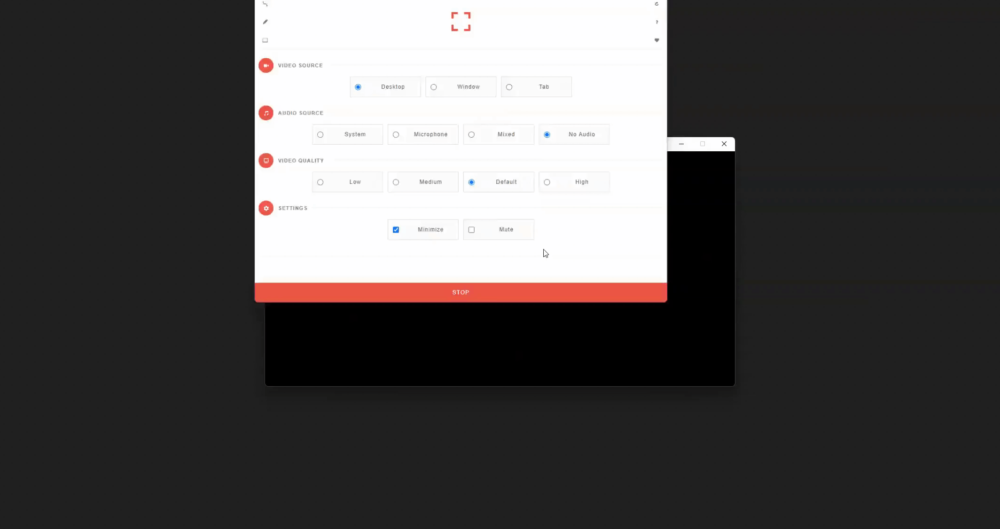

# GravitySimulation
A simple python program to simulate gravitational pulls of point mass objects. The program calcualates the particles' positions at one second intervals. Each pixel on the screen is one meter. 

### How to use:
Progam takes in optional arguments when starting from command line. 
- -a: Load a file with particle information
- -c: Calcuate particle positions. Will ask for number of seconds to simulate
- -l: Loads a file containing particle positions that have already been calculated and saved
- -s: Save calculations to a file

During a simulation you can click the spacebar to pause the screen.
 
### Future Plans:
- If I go back to this project, I want to add it so you can set the time interval for calculations and change the distance per pixel. 
- I would also like to use CUDA to use the GPU for calculations and further optimize the calculations to reduce time. If there are a lot of particles, it takes a long time to calculate. 
- Change the files from plain text to binary format to save room. Long calculations with many particles can easily get too large on disk space.

### Preview

Loading Screen while calcualtions are being done. Using trails to show particles movement better than individual pixels on a gif.

